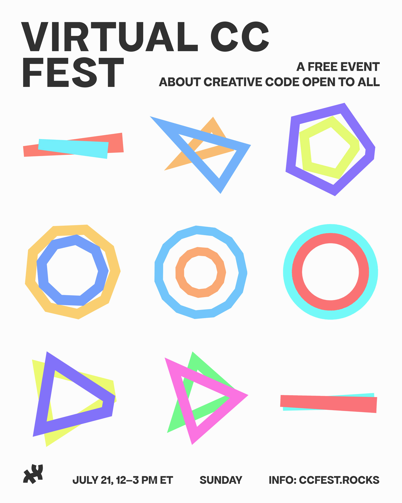
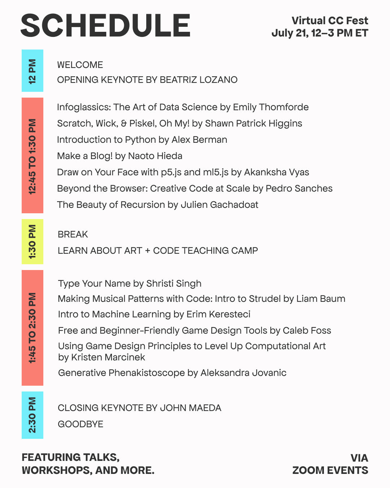
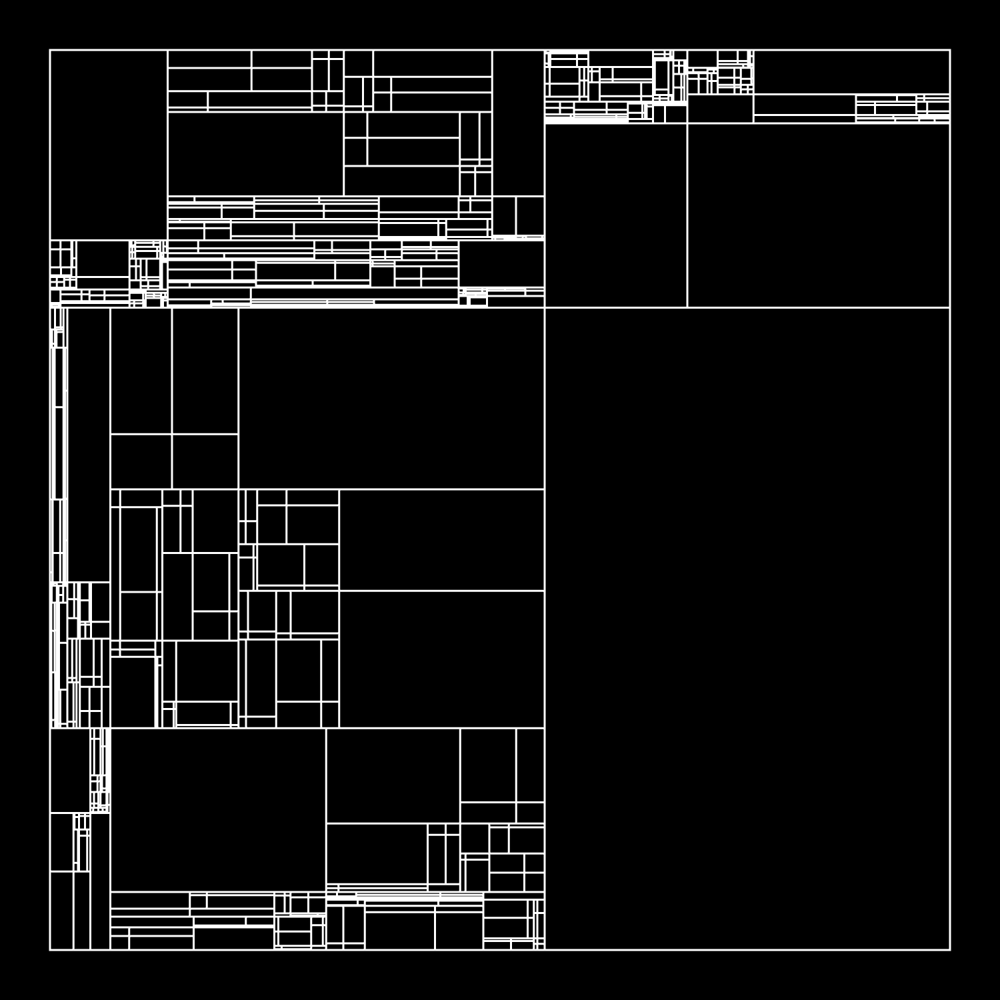
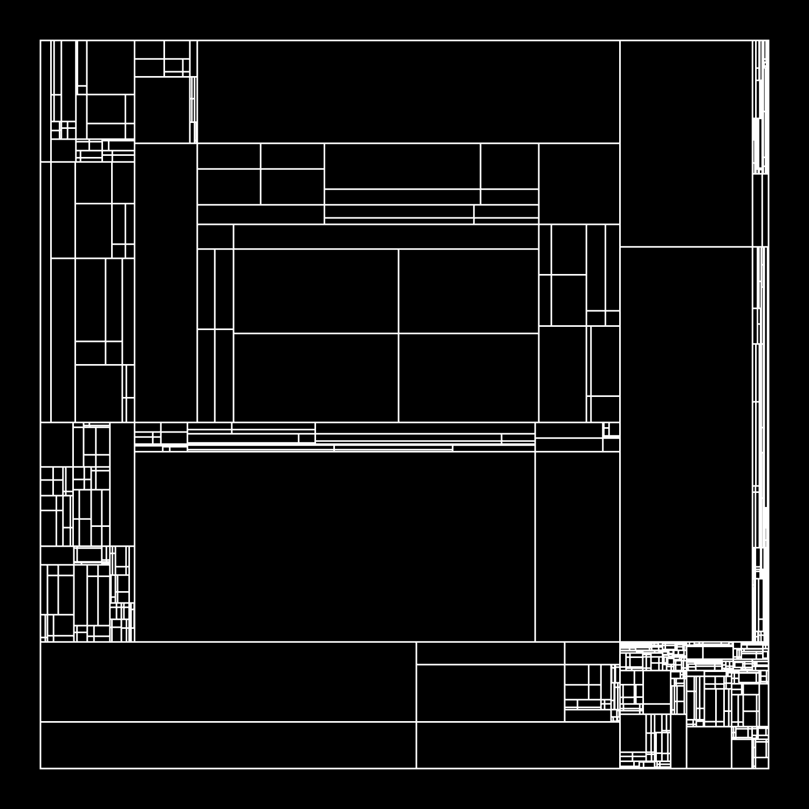

# CCFest24
Workshop resources for [CC Fest Festival 2024 ](https://ccfest.rocks/)

## The Beauty of Recursion
Students will get to learn the recursion principle from a graphic and artistic point of view by coding a square partitioning algorithm in p5.js editor. Random parametrisation will be used to create different sets of graphical outputs that might be exported as vector files for printing thanks to p5.js-svg extension. (Intermediate)

### Presentation
https://www.v3ga.net/presentation/ccfest24

## Sketches
* [Template](https://editor.p5js.org/v3ga/sketches/IqRTP2Ta9) Connect to [p5js editor](https://editor.p5js.org/) and duplicate that script to be able to modify and save it. 
* [Live](https://editor.p5js.org/v3ga/sketches/JMM_g3wBA)
* [Animation](https://editor.p5js.org/v3ga/sketches/xt1n-Iy7J)

